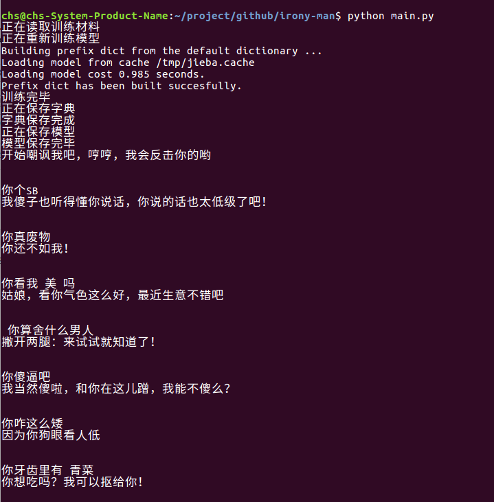

# irony-man
被嘲笑或者辱骂的时候自动反击嘲讽的机器人。A robot that automatically responds to ridicule when ridiculed or abused

#友情提示:
这是一个用于娱乐的项目，切勿较真。

#简介:
基于词向量相似度匹配原理实现的简易聊天机器人，不管你怎么辱骂嘲讽他，都会被反击哦。

#效果图如下:

#运行方法

pip install -r requirements.txt

python main.py

#感谢
希望有兴趣的小伙伴一起参与进来，贡献点思路或者语料～